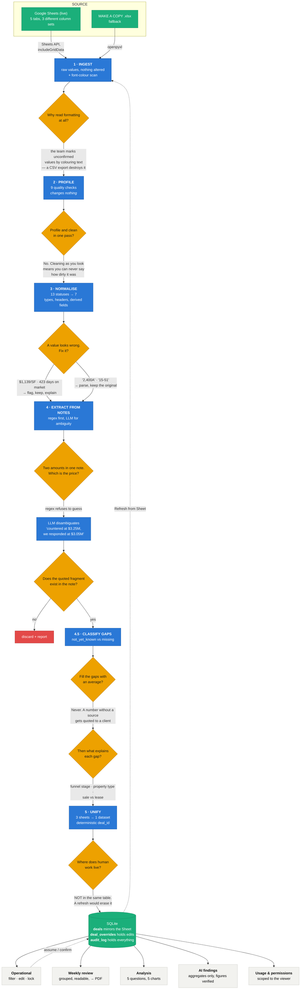

# Case study flowchart

How the thinking went, not just how the bytes move. The decision points are
the part worth reading.

---

## The five decisions that shaped everything

**Formatting is data.** The source marks unconfirmed values by colouring the
text. That signal dies in any CSV export, so the pipeline reads font colours
and turns them into a field — one that can be filtered, counted, and
confirmed with a named source. One cell in the sample carries it; the scan
is generic and would find two hundred.

**Profiling never cleans.** Step 2 measures and writes a report; step 3
changes things. Doing both at once means that when you finish you can no
longer say how dirty the data was — and the brief asks exactly that.

**Nothing is imputed.** No average fills a missing price. In a pipeline a
partner reads out loud, a number without a source gets repeated to a client.
What changed is that we now know which gaps matter: a Sourcing record with
no price is normal, a deal In Contract with no price is an alarm.

**The LLM interprets, it never invents.** For note extraction it must quote
the fragment it read, and the code checks that fragment appears in the
source text. For AI findings it receives only pre-computed aggregates, and
every figure it cites is matched against the numbers Python produced.
Anything that fails is withheld and shown as withheld.

**Human work lives in its own table.** `deals` mirrors the Sheet and is
rewritten on every refresh; `deal_overrides` holds assumptions and
confirmations and is never touched by the ETL. That separation is what makes
a scheduled morning refresh safe. Without it, the first automated run would
delete a week of the team's corrections — and nobody would trust the tool
again.
